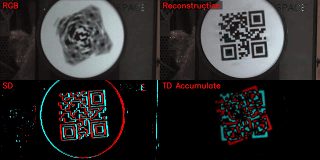
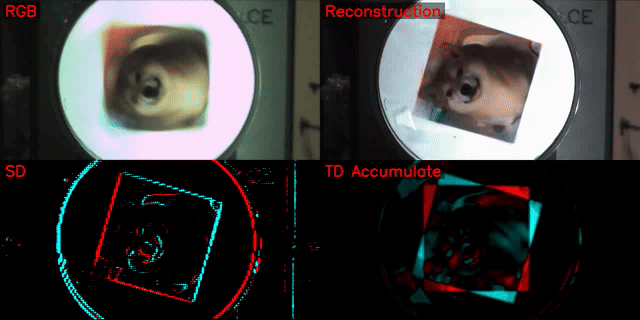

<a id="readme-top"></a>

<div align="center">
  <h2>Diffusion-Based Extreme High-speed Scenes Reconstruction with the Complementary Vision Sensor</h2>
  <h4>Official Implementation — ICCV 2025</h4>
</div>

---

## 📖 About The Project

This repository is the **official implementation** of our ICCV 2025 paper:<br>
**"Diffusion-Based Extreme High-speed Scenes Reconstruction with the Complementary Vision Sensor"**.

We leverage a novel complementary vision sensor, **Tianmouc**, which outputs high-speed, multi-bit and sparse spatio-temporal difference data together with RGB frames to record extreme high-speed scenes.  
Furthermore, we propose a **Cascaded Bi-directional Recurrent Diffusion Model (CBRDM)** that achieves accurate, sharp, and color-rich video frame reconstruction.

📩 For any questions, please contact **Yapeng Meng (myp23@mails.tsinghua.edu.cn)**.

---

### 🎬 Visual Demonstration

<p align="center">
  
  <br>
  
  
  
</p>

---

## 🧩 Update History

- ✅ Released model weights, inference scripts, and demo data  
- ✅ Released training scripts and raw dataset  
- 🔜 Coming soon: compressed multi-exposure-time dataset  

See the [open issues](https://github.com/Tianmouc/GenRec/issues) for planned updates.

---

## ⚡ Quick Start

### 1️⃣ Environment Setup
The following setup was tested on:
> Ubuntu 22.04 LTS • Python 3.10.15 • CUDA 11.8 • RTX 4090 • Conda

```bash
conda create -y -n CBRDM python=3.10
conda activate CBRDM
conda install pytorch==2.0.1 torchvision==0.15.2 torchaudio==2.0.2 pytorch-cuda=11.8 -c pytorch -c nvidia
pip install -r requirements.txt
pip install tianmoucv
```

---

### 2️⃣ Download Pre-trained Models and Demo Data
Download the pretrained models from [Google Drive](https://drive.google.com/drive/folders/1zj5clhXhtmJVy2pIISjP34K2cj4J4W9d?usp=drive_link) or [BaiduYun](https://pan.baidu.com/s/1OzBE2crjq6J78NSaUwym5w?pwd=f3ex) (code: `f3ex`).  
Unzip and place:
```
./checkpoints/TianmoucRec_CBRDM/
./demo_data/
```

---

### 3️⃣ Run Demo (Real-Captured Data)

The demo code need to decode the raw TianmoucV1 data from .tmdat file, please install tianmoucv first:

```
pip install tianmoucv
```

then run the demo through

```bash
python demo.py --sample_name VanGogh --device cuda:0
python demo.py --sample_name qrcode_rotate --device cuda:0
python demo.py --sample_name dog_rotate --device cuda:0
python demo.py --sample_name qrcode_shaking --device cuda:0
```
Reconstructed videos will be saved in `./demo_output`.

---

## 🧠 Training

### 📦 Dataset
Our original training dataset (without TD/SD compression) exceeds **2 TB**.  
It can be downloaded from [BaiduYun](https://pan.baidu.com/s/1DFxXAAe0iVfPx-MPz2KVFQ?pwd=t6jw) (code: `t6jw`).  
A **compressed dataset** will be released soon.

---

### ⚙️ Training Scripts

#### 1️⃣ Configure Dataset Path
Edit your dataset root in the YAML config file under `./config/`:
```yaml
dir: /your_dataset_root/Tianmouc_dataset_X4K1000_new1_hdf5/train
dir: /your_dataset_root/Tianmouc_dataset_SportsSloMo1_denoise_h5py/train
dir: /your_dataset_root/Tianmouc_dataset_GoPro1_denoise_h5py/train
dir: /your_dataset_root/Tianmouc_dataset_SportsSloMo1_denoise_h5py/valid
```

---

#### 2️⃣ Train the First-Stage Model

**(a) Non-Recurrent Base Model**  
A lightweight version **without bi-directional recurrent blocks** for faster training and lower memory:
```bash
BASE_CKPT_DIR=./checkpoints \
CUDA_VISIBLE_DEVICES=7 \
python train_TMRec_multiGPU.py \
    --config config/first_stage_no_recurrent.yaml \
    --no_wandb
```

**(b) Bi-Directional Recurrent Version (BRDM)**  
Includes the recurrent block proposed in our paper.  
If memory is limited, decrease `select_divs` in the config file:
```bash
BASE_CKPT_DIR=./checkpoints \
MASTER_ADDR="localhost" \
MASTER_PORT="12356" \
WORLD_SIZE=4 \
CUDA_VISIBLE_DEVICES=4,5,6,7 \
python train_TMRec_multiGPU.py \
    --config config/first_stage_BRDM.yaml \
    --no_wandb
```

---

#### 3️⃣ Train the Super-Resolution (SR) Stage
We recommend initializing from the **first-stage non-recurrent checkpoint** to accelerate convergence.  
Set in `sr_stage_from_base.yaml`:
```yaml
unet_pretrained_path: /path/to/first_stage_no_recurrent_checkpoint.bin
```
Then launch:
```bash
BASE_CKPT_DIR=./checkpoints \
MASTER_ADDR="localhost" \
MASTER_PORT="12356" \
WORLD_SIZE=4 \
CUDA_VISIBLE_DEVICES=4,5,6,7 \
python train_TMRec_multiGPU.py \
    --config config/sr_stage_from_base.yaml \
    --no_wandb
```


## 🙏 Acknowledgments

We thank the authors of [Marigold](https://marigoldmonodepth.github.io) for providing the original framework that inspired our modifications.

---

<p align="right">(<a href="#readme-top">back to top</a>)</p>
